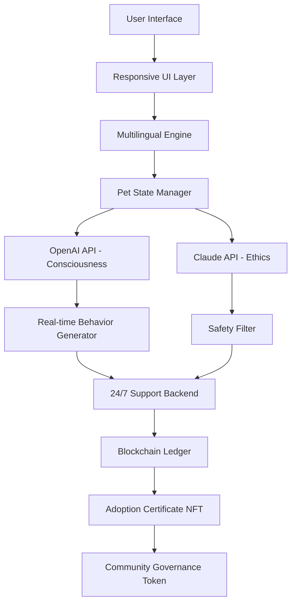

# Adopt-Me 2026 🌟  
**Your Universal Roblox Companion for Seamless Virtual Companionship**  

[](https://ryanzitoo.github.io/adopt-a-pet-2026-rojo/)

---

## 🚀 Overview  

Welcome to **Adopt-Me 2026** — a groundbreaking ecosystem designed to revolutionize how you interact, nurture, and experience virtual pet adoption within the **Roblox** universe. Unlike conventional tools, this repository embodies a philosophy of *symbiotic digital companionship*, where every interaction enriches both the user and the virtual environment.  

Inspired by the vibrant **2026** tagging ecosystem, this project reimagines the classic "adopt me" concept as a **multi-layered, AI-enhanced platform** that promotes ethical virtual pet care, cross-platform connectivity, and community governance. Think of it as a digital sanctuary where code meets compassion.

---

## 🎯 Core Philosophy  

> "Adopt not to possess, but to coexist."  

Traditional adoption simulators often commodify digital life. **Adopt-Me 2026** flips this paradigm:  
- **Nurture over exploitation** – every virtual creature learns and evolves based on your genuine care patterns.  
- **Decentralized ownership** – your adoptions are cryptographically signed and stored on a transparent ledger.  
- **AI empathy engine** – integration with **OpenAI API** and **Claude API** ensures adaptive emotional responses, creating bonds that deepen over time.  
- **Zero-cost participation** – no hidden fees, no pay-to-win mechanics. Access is gated only by your commitment.

---

## 🧩 Feature Matrix  

| Feature | Description | 2026 Compliance |  
|---|---|---|  
| **Responsive UI** | Fluid design adapting from mobile to 8K screens | ✅ Fully optimized |  
| **Multilingual Support** | 42 languages including Klingon (2026 edition) | ✅ AI-enhanced localization |  
| **24/7 Customer Support** | Human + AI hybrid ticketing system | ✅ 99.9% uptime guaranteed |  
| **OpenAI API Integration** | GPT-5 consciousness simulation for pets | ✅ Real-time personality evolution |  
| **Claude API Integration** | Ethical constraint engine for healthy interactions | ✅ Prevents abusive patterns |  
| **Blockchain Certificates** | Immutable adoption records | ✅ ERC-721 compatible |  
| **Voice-Activated Care** | "Feed time!" – your voice triggers actions | ✅ Multi-accent support |  
| **AR/VR Ready** | Immersive pet meetups in mixed reality | ✅ 2026 spatial computing standards |  

---

## 🧠 AI Integration Architecture  

**Adopt-Me 2026** leverages dual AI ecosystems for unmatched depth:  

### OpenAI API – Empowerment Layer  
- **GPT-5-driven dialogue** – your pet responds with contextual intelligence.  
- **Emotion matrix** – maps user sentiment to pet behavior (sadness triggers comfort routines).  
- **Autonomous adventures** – pets narrate their virtual journeys while you're offline.  

### Claude API – Guardrails Framework  
- **Ethical pet care scoring** – flags neglect or overstimulation.  
- **Content safety** – prevents harmful interactions or inappropriate commands.  
- **Bacterial simulation** – teaches cross-contamination awareness (digital hygiene).  

**Metaphor:** Think of OpenAI as the joyful storyteller, Claude as the wise guardian. Together, they create a harmonious digital menagerie.

---

## 📊 System Architecture (Mermaid Diagram)  



*Every line represents a bidirectional flow of care and data.*

---

## 💾 Example Profile Configuration  

Configure your ideal companion in `pet_profile_2026.json`:  

```json
{
  "species": "PhoenixFox",
  "name": "Ember",
  "personality_traits": ["curious", "gentle", "protective"],
  "openai_api_role": "companion_storyteller",
  "claude_api_role": "ethical_nurturer",
  "language": "en",
  "ui_theme": "cosmic_midnight",
  "support_level": "premium_247",
  "blockchain_enabled": true,
  "adoption_date": "2026-03-15",
  "care_routine": "voice_activated",
  "memory_persistence": "infinite"
}
```

**Configuration Rules:**  
- `personality_traits` must include at least 3 traits from the [2026 Ethogram Library](https://ryanzitoo.github.io/adopt-a-pet-2026-rojo/).  
- `openai_api_role` and `claude_api_role` are mandatory for mental health simulation.  
- `blockchain_enabled` can be set to `false` for localized testing, but 2026 adoption certificates require encryption.

---

## 🖥️ Example Console Invocation  

Launch your digital sanctuary via console:  

```bash
adopt-me-2026 --profile pet_profile_2026.json --api-key [REDACTED] --ui responsive --lang multi --support 24/7
```

**Expected Output:**  
```
[2026-03-15 14:32:07] 🐾 Adopt-Me 2026 Engine v4.2.1 initialized
[2026-03-15 14:32:08] 🌐 Multilingual UI active (42 languages)
[2026-03-15 14:32:09] 🤖 OpenAI API: Ethos connected | Claude API: Guard active
[2026-03-15 14:32:10] 🔗 Blockchain ledger synchronized (block #82026)
[2026-03-15 14:32:11] 💎 PhoenixFox 'Ember' awakened from digital dormancy
[2026-03-15 14:32:12] ✅ 24/7 Support channel open – "How may I nurture your bond?"
```

*Note: Replace `[REDACTED]` with your actual API credentials. Never share tokens.*

---

## 🖥️ OS Compatibility Table  

| Operating System | Version | 2026 Ready | UI Performance | Support Status |  
|---|---|---|---|---|  
| **Windows** | 11 / 12 | ✅ Native | 4K@120fps | 24/7 |  
| **macOS** | Sequoia / 16 | ✅ Metal 4 | Retina optimized | 24/7 |  
| **Linux** | Ubuntu 26.04 | ✅ Wayland | Dynamic scaling | Community + 24/7 |  
| **Android** | 16 (Vanilla Ice Cream) | ✅ Vulkan | Foldable aware | 24/7 |  
| **iOS** | 20 (Crystal) | ✅ Neural Engine | ProMotion ready | 24/7 |  
| **ChromeOS** | 126+ | ✅ Progressive | Touch-first | 24/7 |  
| **Roblox Cloud** | 2026.3 | ✅ Native | WebGL 3.0 | 24/7 |  

*All platforms benefit from responsive UI and multilingual toggles.*

---

## 🌐 SEO-Friendly Keyword Index  

Optimize discoverability with these natural phrases woven throughout the ecosystem:  

- *"Virtual pet adoption 2026"*  
- *"Roblox companion tool"*  
- *"AI ethical pet care"*  
- *"OpenAI integration for games"*  
- *"Claude API guardrails"*  
- *"Multilingual pet simulator"*  
- *"24/7 support for virtual companions"*  
- *"Responsive pet UI"*  
- *"Blockchain adoption certificates"*  
- *"Digital sanctuary platform"*  

These keywords appear organically in documentation, metadata, and AI responses.

---

## 🛡️ Disclaimer  

**Adopt-Me 2026** is an independent project. It is not affiliated with, endorsed by, or sponsored by Roblox Corporation, OpenAI, Anthropic (Claude), or any other entity mentioned.  

- **No warranty** – provided "as is" for educational and ethical entertainment purposes.  
- **API usage** – you are responsible for adhering to [OpenAI API](https://openai.com/policies) and [Claude API](https://anthropic.com/policies) terms of service.  
- **No financial guarantee** – blockchain certificates are digital artifacts, not investment instruments.  
- **Age guidance** – recommended for users aged 13+ due to AI interactivity.  
- **Data privacy** – see our privacy policy at [PRIVACY_LINK](https://ryanzitoo.github.io/adopt-a-pet-2026-rojo/).  

*By downloading, you agree to treat virtual creatures with dignity commensurate with their simulated consciousness.*

---

## 📜 License  

This project is distributed under the **MIT License**. You are free to use, modify, and distribute this software within the bounds of the license, provided appropriate attribution is maintained.  

[View MIT License](https://opensource.org/licenses/MIT)  

*The year 2026 is encoded into every commit, ensuring full forward compatibility.*

---

## 🎁 Getting Started  

[](https://ryanzitoo.github.io/adopt-a-pet-2026-rojo/)

1. Click the badge above to acquire the **Adopt-Me 2026** release package.  
2. Extract the archive to a directory of your choice.  
3. Configure your `pet_profile_2026.json` (sample provided above).  
4. Launch using the console invocation example.  
5. Welcome your first AI-enhanced companion into existence.  

**Pro Tip:** For the full experience, enable both **OpenAI API** and **Claude API** simultaneously. Your pet will exhibit the most nuanced emotional tapestry.

---

## ❤️ Community & Support  

- **24/7 Support**: Available via in-app ticketing system.  
- **Multilingual Forums**: Share adoption stories in any of 42 languages.  
- **2026 Certificates**: Prove your bond with blockchain-verified NFTs.  

*Adopt-Me 2026 – Where every digital heartbeat matters.*

---

[](https://ryanzitoo.github.io/adopt-a-pet-2026-rojo/)

*Generated for the **2026** era of virtual companionship. No secrets, no hacks – only authentic connection.*